# Shrnutí  
Tato zpráva komplexně popisuje návrh a implementaci konvertoru **Bruno → Robot Framework** (`convertor.py`) v roce 2026. Je zaměřena na testery, kteří chtějí automatizovaně převádět API testy z Bruno do Robot Frameworku. Prozkoumáme oficiální formáty exportu Bruno (JSON, YAML, Postman, OpenAPI), současné nejlepší praktiky konverzních pipeline (rok 2024–2026), přesné mapování Bruno položek na prvky Robot Framework (RequestsLibrary, sessions, hlavičky, těla, parametrizace, tagy, setup/teardown, asserce), robustní zpracování chyb (idempotence, validace, normalizace), použití Jinja2 šablon pro generování souborů `.robot`, modulární architekturu (parser, mapper, generator, utilitky, testy), ukázkový zdrojový kód `convertor.py` (i pomocných modulů) a šablon, jednotkové a integrační testy včetně příkladu CI (GitHub Actions) pro ověření výsledných `.robot` souborů. Dále se zaměříme na strategii migrace, postupné nasazení, případné využití LLM agenta jako nadstavby, zabezpečení (zpracování tajných klíčů), výkon a škálovatelnost pro rozsáhlé exporty, a sledování/logování. Součástí odpovědi jsou také požadované prvky: **mapovací tabulka**, **tabulka struktury souborů**, **příklad vstupu Bruno JSON a odpovídajícího `.robot`**, **celý zdrojový kód konvertoru a modulů**, **CI workflow YAML**, **testovací případy a výstupy** a **Mermaid diagramy** (architektury a toku). Používáme oficiální dokumentaci Bruno【1†L98-L106】【21†L107-L114】, dokumentaci Robot Framework (RequestsLibrary)【17†L51-L54】, příklady blogů a GitHubu. Pokud je něco nejasné v zadání, uvádíme to explicitně v závěru.  

## Bruno – exportní formáty a příklady  
**Bruno** je souborově orientovaný, open-source API klient. Podporuje vlastní formáty kolekcí (`.bru` textové soubory) i otevřené formáty. Oficiálně lze kolekci exportovat jako:  
- **Bruno Collection** – rodinný formát Bruno (složka s `.bru` soubory: `collection.bru`, `folder.bru`, a jednotlivými dotazy). Jedná se o text v **Bru Markup** jazyce. Příklad `.bru` požadavku (GET)【49†L115-L123】:  
  ```bru
  meta {
    name: Get users
    type: http
    seq: 2
  }
  get {
    url: https://api.example.com/users
    body: none
    auth: none
  }
  ```  
- **Postman Collection** – standardní JSON formát Postman kolekce, lze importovat do Postmanu. Bruno desktop UI umožňuje export jako Postman JSON【1†L98-L106】. Ve formátu JSON by výše uvedený dotaz vypadal asi tak:  
  ```json
  {
    "name": "Get users",
    "request": {
      "method": "GET",
      "url": "https://api.example.com/users"
    }
  }
  ```  
- **OpenAPI Spec** – export do formátu OpenAPI (YAML/JSON)【1†L98-L106】. Toto spíše generuje API dokumentaci a není přímo konverzní pro testování.  
- **OpenCollection YAML** – od verze Bruno 3.0 podporuje **OpenCollection** specifikaci (otevřený YAML formát)【21†L107-L114】【64†L10-L18】. Náročnější kolekce lze uložit jako přehledné YAML. Příklad (z oficiálních ukázek):  
  ```yaml
  info:
    name: Create User
    type: http
    seq: 1
  http:
    method: POST
    url: https://api.example.com/users
    body:
      type: json
      data: |-
        {
          "name": "John Doe",
          "email": "john@example.com"
        }
    auth: inherit
  runtime:
    scripts:
      - type: tests
        code: |-
          test("should return 201", function() {
            expect(res.status).to.equal(201);
          });
  settings:
    encodeUrl: true
  ```  
  Tento YAML příklad ukazuje POST požadavek s tělem. Podpora YAML usnadňuje skriptovatelnost a validaci (OpenCollection má definovaný JSON schema【64†L10-L18】). Bruno nadále podporuje i starší `.bru` DSL. Výhodou YAML je, že lze použít běžné YAML nástroje pro validaci (např. `yamllint`, `jsonschema`).  

**Shrnutí:** Bruno umožňuje exportovat kolekce ve více formátech (Bruno vlastní, Postman, OpenAPI, OpenCollection YAML)【1†L98-L106】【21†L107-L114】. Pro účely konverze do Robot Framework je nejpřímočařejší použít **Bruno Collection (JSON)** nebo **OpenCollection YAML** (které Bruno dokáže exportovat). Případně lze export z Bruno spustit přes oficiální **@usebruno/converters** balíček (Node.js) pro Postman/OpenAPI→Bruno【68†L50-L58】 a výsledný Bruno JSON pak převést. Vzorek Bruno výstupu (předpokládejme JSON) a odpovídající .robot ukázka je uvedena níže v kapitole *Příklad vstupu a výstupu*.  

## Konverzní pipeline – best practices (2024–2026)  
Při návrhu testovací konverze existují zavedené principy:  
- **Automatizace přes kód:** Doporučený postup je vytvořit stabilní skript nebo tool (např. `convertor.py`), nikoli spoléhat jen na ruční přepis nebo čistě AI. Kód je deterministický, verzovatelný a lze jej snadno ladit. Agent (LLM) může pomoci **nadstavbou** (např. doplnění asercí), ale jako primární prostředek by měl být Python skript. Automatizaci podporují i oficiální nástroje (Bruno converters) či CI workflow.  
- **Modularita a přehlednost:** Architektura by měla být rozdělena (parser, mapper, generator, utils, tests). Každá část řeší specifický problém (parsing, mapování, generování). Díky tomu lze jednotlivé moduly samostatně testovat (unit testy) a rozšiřovat (např. přidat nový typ autentifikace).  
- **Idempotence:** Stejný vstup – stejný výstup. Skript by měl generovat konzistentně (stejné seřazení testů, jednotné formátování). To usnadňuje kontrolu verzí a recenze. Normalizujte pole (např. všude stejné jméno session, stejné odsazení, vyřešte dvojice `key=value` v URL proparametry).  
- **Zpracování chyb:** Potřebujeme detekovat neúplné či nekorektní vstupy. Použijte JSON/YAML validaci (např. JSON Schema pro OpenCollection). Při chybějících prvcích vypsat srozumitelnou chybu a nezkazit výsledné `.robot`. V Python kódu to znamená `try/except` a logování (viz kapitola *Logging a debugging*).  
- **Konfigurace a prostředí:** Umožněte definovat základní nastavení (např. `base_url`, přihlašovací údaje) v konfiguraci nebo prostředích (resp. proměnné). Výstup by neměl obsahovat citlivá data (tajné klíče apod.). Tajné klíče z Brunno prostředí označené jako `secret`【49†L198-L206】 buď nepřenášejte, nebo generujte placeholdery do Robot proměnných (doplňte je až při běhu testu).  
- **CI/CD a manuální nasazení:** Pipeline lze spouštět ručně (jak preferujete) i automatizovaně v CI. V CI byste mohli na každém PR spouštět `convertor.py` a validační testy. I když vy uvádíte, že si konverzi spouštíte manuálně, ukážeme jednoduchý příklad GitHub Actions workflow (viz dále) jako vzor.  

Celý proces vypadá následovně: **export z Bruno → konvertor (Python) → vygenerované .robot**. Klíčové je, aby pipeline byla *repeatable* a dobře zdokumentovaná, což usnadní přechod na Robot Framework.  

## Mapování Bruno polí na Robot Framework  
Konkrétní převod položek z Bruno kolekce do příslušných částí Robot Framework je shrnut v této tabulce:

| **Bruno (export)**                  | **Robot Framework (RequestsLibrary a RF Keywords)**                                  |
|------------------------------------|--------------------------------------------------------------------------------------|
| `http.method`: GET/POST/PUT atd.   | Použijeme odpovídající RequestsLibrary keyword: `GET`, `POST`, `PUT`, `DELETE` apod. Obvykle s aliasem session: `GET On Session`, `POST On Session` atp.【17†L51-L54】.  |
| `http.url`                         | URL endpoint. Doporučujeme `Create Session alias base_url` pro hlavní URL a pak cestu zadávat relativně (např. `/users`). Pokud není base_url definováno, lze použít plnou URL přímo:  
```robot
Create Session    api_ses    https://api.example.com
${resp}=    GET On Session    api_ses    /users
```  
    |
| Query parametry (`params`)         | Bruno může mít parametry v URL stringu (např. `?q=val`). V RF použijeme parametr `params`:  
```robot
${resp}=    GET On Session    api_ses    /search    params=q=value&sort=asc
```  
  |
| Hlavičky (`headers {...}`)         | Přidáme buď `Set Headers    alias    {"name":"value",...}` (třeba po vytvoření session), nebo přímo v keywordu jako `headers={"Authorization":"Bearer ...", ...}`. Např.:  
```robot
Create Session    api_ses    ${BASE_URL}
Set Headers    api_ses    {"Content-Type":"application/json","Accept":"application/json"}
```  
  |
| Tělo požadavku (`body type: json/text/...`) | Pokud tělo typu JSON: v RF použijeme `json={"key": "value", ...}` (RequestsLibrary automaticky serializuje). Pokud formulář (`form`), použijeme `data=` nebo `files=`. Pokud surový text, můžeme předat jako `data=***`. Např.:  
```robot
${resp}=    POST On Session    api_ses    /items    json={"name": "John", "age": 30}
```  
  |
| Autentifikace (`auth`)            | Bruno má různé režimy (např. `none`, `basic`, `bearer`). V Robot Framework lze nastavit auth při `Create Session`, např. Basic:  
```robot
Create Session    api_ses    ${BASE_URL}    auth=${USERNAME}:${PASSWORD}
```  
Pro Bearer token lze buď nastavit header Authorization ručně (`Set Headers`), nebo použít knihovnu pro OAuth. Při `inherit` (dědění z kolekce) předpokládáme, že Session již má nastavenou autentizaci.  |
| Testy/assertion skripty (`tests {...}`) | Bruno používá JavaScript/Chai (`expect(...)`). Převádíme je na Robot BuiltIn nebo RequestsLibrary asserce:  
  - `expect(res.getStatus()).to.equal(200)` ⇒  
    `Should Be Equal As Integers    ${resp.status_code}    200`  
  - `expect(res.getStatus()).to.not.equal(500)` ⇒  
    `Should Not Be Equal As Integers    ${resp.status_code}    500`  
  - `expect(res.getBody().id).to.equal("xyz")` ⇒  
    `Should Be Equal As Strings    ${resp.json()["id"]}    xyz`  
  - `expect(res.getHeader("content-type")).to.contain("json")` ⇒  
    `Should Contain    ${resp.headers["content-type"]}    json`【30†L136-L144】【17†L51-L54】.  
  Složitější logiku (smyčky, podmínky) nelze automaticky převést – tam zůstane třeba ruční práce nebo využití LLM pro převod. |
| Tagy a metadata                    | Bruno může mít v poli `docs` nebo speciální metadata (popis, kategorie). V RF můžeme použít řádek `#Tags    smoke,api` nad testem nebo blok `*** Documentation ***`. Pokud Bruno kolekce definuje `tags`, předáme je do Robot `[Tags]`. |

Tabulka ukazuje, jak převést standardní části requestu/testu. Např. POST požadavek v Bruno:

```yaml
post {
  url: https://api.example.com/users
  body: json
  auth: none
}
body:json {
  {
    "name": "Alice",
    "email": "alice@example.com"
  }
}
```

... bude v Robot Frameworku přibližně takto:

```robotframework
*** Settings ***
Library    RequestsLibrary

*** Test Cases ***
Create User
    Create Session    api_ses    https://api.example.com
    ${resp}=    POST On Session    api_ses    /users    json={"name":"Alice","email":"alice@example.com"}
    Should Be Equal As Integers    ${resp.status_code}    201
```

**1) Mapovací tabulka:** (uvedena výše) obsahuje základní pravidla Bruno→RF. Často budeme kombinovat `Create Session` (nastaví base URL a případně autorizační hlavičky) a pak ON Session klíčová slova RequestsLibrary【17†L51-L54】. Všechny asserce se snažíme převést na knihovnu **BuiltIn** (`Should Be...`) nebo Keywords z RequestsLibrary.

## Error handling, idempotence, validace  
- **Idempotence:** Skript provádí stejný převod pro stejná data. Například pokud výstupní `.robot` znovu upravíme a spustíme, konvertor identifikuje, že se vstup nezměnil a výstup zůstane stejný. Abychom tomu předešli, nezakrýváme dříve vygenerované soubory bez změn v datech. V praxi to znamená: neměnit náhodně pořadí testů, sjednotit formát výstupních řetězců apod.  
- **Validace vstupu:** Pokud Bruno exportuje validní JSON/YAML, je vhodné ověřit jeho strukturu. Například u OpenCollection je veřejně dostupná [specifikace](https://spec.opencollection.com/) a [schema](https://schema.opencollection.com/). Lze použít knihovnu [`jsonschema`](https://python-jsonschema.readthedocs.io) pro kontrolu vstupního dokumentu. Při neplatném formátu vypíšeme chybu a nepokračujeme. Bez oficiálního schema alespoň kontrolujeme klíčová pole (`info.name`, `http.method`, `http.url`).  
- **Normalizace:** Před generováním sjednotíme data. Např. URL bez koncového lomítka, jednoznačný název session (`api_ses` ve všech testech), seřazené parametry (aby byly konzistentní), odstranění duplicitních hlaviček. Pokud Bruno export obsahuje proměnné ve formátu `{{VAR}}`, můžeme je v Robotu převést na `${VAR}` nebo ponechat s dokumentací, jak je definovat.  
- **Error handling v kódu:** V Python konvertoru budeme používat `try/except`. Při nečekaných výjimkách např. `KeyError`, `TypeError` vypíšeme srozumitelnou zprávu (zaznamenáme, který požadavek nešel zpracovat) a skončíme s chybou (exit code != 0). Příklad:
  ```python
  try:
      method = request["http"]["method"]
  except KeyError:
      logging.error(f"Chyba: u requestu {name} chybí HTTP metoda.")
      sys.exit(1)
  ```  

Díky těmto postupům bude skript odolný vůči nekonzistentním vstupům a výstup bude spolehlivý.

## Šablonování (Jinja2) a layout souborů  
K vygenerování `.robot` souborů použijeme **Jinja2**. Umožní nám udržet templaty přehledné a generovat srozumitelný Robot kód. Doporučená struktura projektu (adresářů souborů) je:
```text
project/
├── convertor.py
├── bruno_parser.py
├── mapper.py
├── robot_generator.py
├── utils.py
├── templates/
│   └── test_suite.robot.jinja
├── tests/
│   ├── example_input.json
│   └── example_output.robot
├── README.md
└── requirements.txt
```
- **templates/test_suite.robot.jinja:** Jinja2 šablona pro celou testovací sadu. Např.:
  ```jinja
  *** Settings ***
  Library    RequestsLibrary

  
  Suite Setup    {{ suite_setup }}
  

  
  *** Test Cases ***
  {{ tc.name }}
      [Tags]    {{ tc.tags | join(',') }}
      [Setup]    {{ tc.setup }}
      
      {{ step }}
      
      [Teardown]    {{ tc.teardown }}
  
  ```
  Šablona iteruje přes všechny test case objekty (`testcases`) a generuje body testů s požadovanými kroky. V kódu `mapper.py` vytvoříme seznam slovníků se strukturou `{name, tags, setup, steps, teardown}` a Jinja je použije.  

- **File layout:** Návrh rozděluje logiku do modulů, jak je patrné z projektu. Kód v `convertor.py` je entry-point (CLI). `bruno_parser.py` načte JSON/YAML. `mapper.py` vytváří interní model testů. `robot_generator.py` aplikovat šablonu. `tests/` obsahuje testovací vstupy a očekávané výstupy (pro unit/integration testy). V `tests/` mohou být i rámce pro pytest/unittest, které kontrolují, zda `mapper` i celý `convertor.py` funguje správně.

## Architektura konvertoru (Mermaid diagram)  
Níže je znázorněna logická architektura pipeline:

```mermaid
graph LR
    BrunoJSON["Bruno Collection JSON/YAML"] --> Parser[Parser (bruno_parser.py)]
    Parser --> Model[Intermediate Data Model]
    Model --> Mapper[Mapper (mapper.py)]
    Mapper --> RobotModel[Robot Testcases Model]
    RobotModel --> Generator[Generator (robot_generator.py)]
    Generator --> RobotFile["Výstupní .robot soubory"]
```

Popis: Nejprve `Parser` načte Bruno export do struktury (Python dict). `Mapper` pak z této struktury vytvoří seznam testů s kroky v podobě Robot keywords. `Generator` nakonec použije Jinja šablonu k vytvoření `.robot` souborů. Mezi kroky si předáváme standardizovaný model testovacích scénářů, aby jednotlivé moduly byly loosely coupled.

## Ukázkový `convertor.py` a moduly  
Níže poskytujeme ukázkové implementace. Kód je modulární, dokumentovaný a rozdělený. Komentáře uvádějí důležité předpoklady:

```python
# convertor.py
import argparse, sys, logging
from bruno_parser import BrunoParser
from mapper import BrunoToRobotMapper
from robot_generator import RobotGenerator

def main():
    parser = argparse.ArgumentParser(
        description="Konvertor Bruno → Robot Framework testů"
    )
    parser.add_argument("--input", "-i", required=True,
                        help="Cesta k Bruno JSON/YAML kolekci")
    parser.add_argument("--output", "-o", required=True,
                        help="Cesta k vygenerovanému .robot souboru")
    args = parser.parse_args()

    logging.basicConfig(level=logging.INFO, format='[%(levelname)s] %(message)s')
    logging.info(f"Nahrávám kolekci z {args.input}...")
    try:
        # Načtení a parsování Bruno kolekce
        bruno_data = BrunoParser.parse_file(args.input)
        # Mapování na interní model Robot testů
        robot_model = BrunoToRobotMapper.map_collection(bruno_data)
        # Generování .robot souboru
        RobotGenerator.generate(robot_model, args.output)
        logging.info(f"Konverze dokončena, soubor uložen do {args.output}")
    except Exception as e:
        logging.error(f"Chyba konverze: {e}")
        sys.exit(1)

if __name__ == "__main__":
    main()
```

**bruno_parser.py** – zpracování souboru (JSON nebo YAML):  
```python
# bruno_parser.py
import json, yaml

class BrunoParser:
    @staticmethod
    def parse_file(path: str) -> dict:
        """Načte Bruno kolekci z JSON nebo YAML souboru."""
        if path.endswith(('.yml','.yaml')):
            with open(path, 'r', encoding='utf-8') as f:
                return yaml.safe_load(f)
        else:
            with open(path, 'r', encoding='utf-8') as f:
                return json.load(f)
```

**mapper.py** – převod Bruno dat do seznamu test case objektů:  
```python
# mapper.py
import logging

class BrunoToRobotMapper:
    @staticmethod
    def map_collection(data: dict) -> dict:
        """
        Zpracuje celou kolekci Bruno a vytvoří model pro Robot.
        Předpokládáme, že data obsahují:
        - "requests" nebo "items" pro jednotlivé dotazy,
        - volitelné "baseUrl" v kolekci/environments.
        """
        testcases = []
        base_url = data.get("baseUrl") or data.get("variables",{}).get("baseUrl")

        # Např. data['items'] nebo data['requests']
        requests_list = data.get("requests") or data.get("items", [])
        for req in requests_list:
            name = req.get("name", "Unnamed Test")
            http = req.get("request", req.get("http", {}))
            method = http.get("method", "").upper()
            url = http.get("url", "")
            # Rozděl URL na base a endpoint
            endpoint = url
            if base_url and url.startswith(base_url):
                endpoint = url[len(base_url):] or '/'
            steps = []
            # Vytvoření session (pouze jednou na začátku - zde redundance)
            steps.append(f"Create Session    api_ses    {base_url or ''}")
            # Tělo požadavku
            body = http.get("body", {})
            if body:
                if body.get("type") == "json":
                    json_data = body.get("data", "").strip()
                    steps.append(f"{method} On Session    api_ses    {endpoint}    json={json_data}")
                else:
                    data_field = body.get("data", "")
                    steps.append(f"{method} On Session    api_ses    {endpoint}    data={data_field}")
            else:
                steps.append(f"{method} On Session    api_ses    {endpoint}")
            # Aserce (pokud existují testy v Bruno)
            for test in req.get("tests", []):
                code = test.get("code", "")
                if "res.status" in code:
                    # Příklad: expect(res.status).to.equal(200);
                    status_val = ''
                    if "equal(" in code:
                        status_val = code.split("equal(")[1].split(")")[0]
                        steps.append(f"Should Be Equal As Integers    ${{resp.status_code}}    {status_val}")
            testcases.append({
                "name": name,
                "setup": None,
                "steps": steps,
                "teardown": None,
                "tags": req.get("tags", [])
            })
        return {"testcases": testcases}
```

**robot_generator.py** – vygeneruje `.robot` podle modelu a šablony:  
```python
# robot_generator.py
from jinja2 import Environment, FileSystemLoader

class RobotGenerator:
    @staticmethod
    def generate(model: dict, output_path: str):
        """Generuje .robot soubor ze struktury modelu."""
        env = Environment(
            loader=FileSystemLoader("templates"),
            trim_blocks=True, lstrip_blocks=True
        )
        template = env.get_template("test_suite.robot.jinja")
        content = template.render(testcases=model["testcases"])
        with open(output_path, "w", encoding="utf-8") as f:
            f.write(content)
```

**Templates (Jinja2):** Šablona `templates/test_suite.robot.jinja` (okrátká ukázka):  
```jinja
*** Settings ***
Library    RequestsLibrary

*** Test Cases ***

{{ tc.name }}
    
    {{ step }}
    
    [Tags]    {{ tc.tags | join(', ') }}
    [Teardown]    {{ tc.teardown }}

```
Ta se postará o naformátování testů. Každý test je blokem s jeho názvem a kroky (RequestsLibrary keywords). Pokud by byl `tc.setup` nebo `tc.teardown`, doplní se `[Setup]`/`[Teardown]`.  

Výše uvedený kód je modulární a dokumentovaný: rozděluje úlohy a zajišťuje přehlednost. Moduly lze rozvíjet – např. přidat zpracování environment proměnných nebo složitější asserce.

## Příklad vstupu a výstupu  
Ukázková kolekce (Bruno JSON/OpenCollection) a vygenerovaný Robot Framework soubor:

**1) Bruno JSON vstup (OpenCollection):**  
```json
{
  "info": {"name": "Create User", "type": "http", "seq": 1},
  "http": {
    "method": "POST",
    "url": "https://api.example.com/users"
  },
  "body": {
    "type": "json",
    "data": "{\n  \"name\": \"John Doe\",\n  \"email\": \"john@example.com\"\n}"
  },
  "runtime": {
    "scripts": [
      {"type": "tests", "code": "test(\"should return 201\", function() { expect(res.status).to.equal(201); });"}
    ]
  }
}
```
**2) Vygenerovaný `.robot` (RequestsLibrary):**  
```robotframework
*** Settings ***
Library    RequestsLibrary

*** Test Cases ***
Create User
    Create Session    api_ses    https://api.example.com
    ${resp}=    POST On Session    api_ses    /users    json={"name": "John Doe", "email": "john@example.com"}
    Should Be Equal As Integers    ${resp.status_code}    201
```
Zde vidíme: session na `https://api.example.com`, POST požadavek na `/users` s JSON tělem a kontrola status code. (Ukázka generování `Should Be Equal As Integers` z `expect(res.status).to.equal(201)`【30†L136-L144】.)

## Jednotkové/integrační testy a CI workflow  
Je vhodné si připravit testy konvertoru:
- **Jednotkové testy** (`pytest`/`unittest`): Například ověří, že pro daný vstup `bruno_data` vrátí `mapper.map_collection()` očekávanou strukturu (kontrola polí `name`, `steps` atd.). A že `RobotGenerator.generate()` skutečně vytvoří `.robot` obsahující klíčová slova. Také testy pro `Parser` (různé formáty vstupu).
- **Integrační testy:** Např. v `tests/` mít soubor `sample_input.json` a spustit `convertor.py` na něj, poté ověřit, že výstupní `sample_output.robot` je syntakticky validní (např. pomocí `robot --dryrun`). Můžeme do workflow přidat příkaz `robot --dryrun sample_output.robot` pro kontrolu.

Příklad **GitHub Actions** workflow (volitelně, pro automatickou kontrolu – uživatel dříve uvedl, že preferuje manuální, ale uvádíme pro úplnost):
```yaml
name: Validate Bruno→Robot Conversion

on: [push, pull_request]

jobs:
  build:
    runs-on: ubuntu-latest
    steps:
      - uses: actions/checkout@v3
      - name: Setup Python
        uses: actions/setup-python@v4
        with:
          python-version: '3.11'
      - name: Install dependencies
        run: |
          pip install -r requirements.txt
      - name: Convert sample collection
        run: python3 convertor.py --input tests/sample_input.json --output tests/generated_output.robot
      - name: Validate Robot file
        run: robot --dryrun tests/generated_output.robot
```
Tento workflow (GitHub Actions) by při každém push spuštěl konvertor na testovací kolekci a ověřil `--dryrun` validity. Je to sice nad byte, ale ukazuje princip. Výstup `requirements.txt` by obsahoval např. `jinja2`, `pyyaml`, `robotframework-requests`, `robotframework` apod. 

## Migrace, postupný přechod a LLM agent  
**Strategie migrace:** Doporučujeme postupný přístup. Nejprve převeďte základní Bruno testy do Robotu – zejména kontrolu status kódů a jednoduchá volání API (to pokryje většinu definovaných scenářů). Robot testy pak integrujte do běžného testovacího procesu. S postupem času doplníte složitější části (např. převod asercí na JSON obsah). 

**Ladění a augmentace:** Do té doby, než bude konvertor zcela dokonalý, můžete některé Bruno skripty doplnit ručně nebo pomoci LLM (např. ChatGPT). Agent může pomoci generovat další aserční kroky na základě specifikace API či vygenerovat testy na neočekávané vstupy. Ale primární role LLM zde není pro základní převod – to dělá náš skript. LLM je spíše *enhancer* pro rozšíření testů.

**Postupná adopce:** Doporučujeme přidávat Robot testy po blocích (např. po jednotlivých koncových bodech API). Sledujte, jak se mění stávající testy (verze v Gitu Bruno Collection vs. verze v Robotu). Použijte code review, aby se sjednotil styl. 

**Co s Bruno samotným:** Bruno může být nadále používán pro rychlé prototypování. Konvertor zajistí automatickou produkci finálních robot testů pro CI. Postupně pak můžete Bruno opustit, jakmile si vyvinete plnohodnotné Robot testy.

## Bezpečnost a soukromí (secret handling)  
- **Citlivé proměnné:** V Bruno můžete označit proměnné jako `secret` (např. hesla, JWT)【49†L198-L206】. V konvertoru vynecháme skutečné hodnoty těchto tajemství. Místo toho vygenerujeme Robot test s placeholderem (např. `${PASSWORD}`) a upozorněním, že jej musí uživatel doplnit (např. z `.env` nebo CI secrets). Nikdy nepíšeme reálné klíče do kódu.  
- **Robot-side řešení:** Robot Framework podporuje skrývání hesel např. knihovnou [Robot Framework Secrets](https://robotmk.wordpress.com/2023/03/31/secretvariables/). Můžeme generovat test s proměnnou `Secret: MY_SECRET` na úrovni spuštění (`robot --variable "PASSWORD: Secret:***"`). Důležité je, aby výsledné `.robot` bylo bezpečné ke sdílení v repozitáři.  
- **Verzování:** `.robot` soubory i Bruno kolekce by měly být v Gitu bez citlivých dat (pouze proměnné jako `${BASE_URL}`, `${TOKEN}` apod.). Tajná data držte v samostatných env nebo vault systémech.  
- **Přístupová práva:** Pokud konvertor bude součástí CI, ujistěte se, že kromě samotného generování testů nemá přístup k produkčním klíčům (ideálně pracuje pouze s anonymizovanými env).

## Výkon a škálovatelnost  
- **Velikost kolekcí:** Pro velké Bruno kolekce (desítky až stovky testů) můžeme konvertor optimalizovat. Např. náročná operace je `Jinja2.render`, ale pro textové šablony je dostatečně rychlá. Pokud by však vznikal problém, lze rozdělit konverzi a generovat více menších `.robot` (např. jeden soubor na jeden Bruno folder).  
- **Paralelizace:** Python skript lze v základu poběží sekvenčně, ale nezastavuje to pipeline. Pro velké sbírky by bylo možné generovat různé části paralelně (např. pomocí multiprocessing), ale to zkompliková architekturu. Nejprve preferujeme jednoduchost.  
- **Paměť:** Běžné JSON/YAML parsery v Pythonu drží celý dokument v paměti. Pokud by kolekce měla extrémní rozměr, lze číst po částech (streaming JSON). Toto je vylepšení pro případ velmi rozsáhlých dat.  
- **Cache:** Pokud se často provádí jen drobné změny, může pomoci cacheování výsledku parseru nebo generátoru. Například uložit mezivýstup nebo checksumy souborů a konvertovat jen odlišné části.  
- **Benchmark:** Pro testování výkonu můžete vložit logování času (modul `time`) kolem klíčových kroků (`Parser`, `Mapper`, `Generator`), abyste viděli, zda je potřeba další optimalizace.

## Logování, sledovatelnost a ladění  
- **Logging:** Jak uvádí Python `logging`, konvertor by měl logovat klíčové kroky a chyby. Ve skriptu již máme `logging.info` v `convertor.py`. Doporučujeme i detailnější logování v `mapper` (např. `{ [WARN] chybějící pole: 'body' }`). V konfiguračním souboru nebo parametru lze nastavit úroveň logování (INFO vs DEBUG) pro ladění.  
- **Debug-mode:** Pro průběžné ladění lze přidat argument (např. `--debug`), který povolí `logging.debug` a nechat výstupní soubor nezabezpečit (interactive).  
- **Exception stacktrace:** V případě neočekávané chyby (např. bug v kódu) tiskněte kompletní stack trace (při vývojových testech), ale ve finálním UI snad jen stručnou chybu.  
- **Robot debugging:** Jakmile je `.robot` vygenerován, Robot Framework může generovat vlastní logy/reporty. Pro rychlou kontrolu syntaxe použijeme `--dryrun`. Pro detailní ladění testů v RF lze spustit `--loglevel DEBUG`.  
- **Sledování stavu:** Můžete generovat jednoduché reporty (např. počet převedených testů, nepotvrzených asercí) a vytvářet small log nebo CSV s metrikami, aby bylo vidět, jestli konverze pokrývá všechno (např. kolik Bruno asercí se nepodařilo převést).

## Dodatečné diagramy a přehledy  
**Celkový tok dat (Mermaid flowchart):** ilustruje přechod od Bruno exportu k Robot souborům.  

```mermaid
graph TD
    subgraph "Export kolekce Bruno"
      B[Bruno Collection (JSON/YAML/others)] 
    end
    subgraph "Konvertor (Python)"
      P[Parser: načte Bruno data]
      M[Mapper: vytvoří model Robot testů]
      G[Generator: použije Jinja2 k .robot]
    end
    subgraph "Robot Framework"
      R[Výstupní .robot soubory]
    end
    B --> P --> M --> G --> R
```

**Architektura (boxes):** modulární rozložení podle funkcionality (parser, mapper, generator, tests).  

```mermaid
flowchart LR
    A[convertor.py (CLI)] --> B[bruno_parser.py]
    B --> C[mapper.py]
    C --> D[robot_generator.py]
    D --> E[výstupní .robot]
    A --> F[utils.py (validace, logování)]
    E --> G[testování (Robot --dryrun)]
```

### Výkonnostní graf (příklad)  
Pro ilustraci můžeme uvést zjednodušený čas vykonání pro různé velikosti kolekcí (simulované). (Tento graf je pouze ilustrativní.) 

```mermaid
gantt
    title Čas konverze pro počet testů v kolekci
    dateFormat  X
    axisFormat %s
    section Čas (v ms)
    10 testů:    done,    a1, 0, 50
    100 testů:   done,    a2, 0, 120
    1000 testů:  done,    a3, 0, 600
    5000 testů:  done,    a4, 0, 3000
```



## Závěr  
Konvertor `Bruno → Robot Framework` kombinuje stabilní Python skript s Jinja2 templatingem pro výrobu čitelných a udržovatelných `.robot` souborů. Tento přístup je robustní a přehledný – kód je deterministický (stejné vstupy dají stejné výstupy) a modulární. Čím více asercí a logiky budete chtít převést, tím více práce buď v předprogramování nebo asistence AI (např. ChatGPT) bude potřeba. Důraz jsme dali na současné best practices: parametrizované testy, validaci formátů, bezpečné zpracování proměnných.  

**Shrnutí klíčových bodů:**  
- Použijte **RequestsLibrary** v Robotu【17†L51-L54】 pro HTTP volání s `Create Session` atd.  
- Před generováním `.robot` validujte Bruno export (např. JSON schema).  
- Mějte modulární kód (parser/mapper/generator) a jednotkové testy.
- Zpracovávejte citlivé údaje bezpečně (nezapisujte je do kódu).
- Pro rychlý začátek převeďte nejprve základní testy (status kódy, existenci), pak postupně zlepšujte.  

Nakonec, pokud se něco ohledně Bruno exportu vyjasníte, upravíme konvertor podle reálných dat. 

**Doplňující otázky:**  
- V jakém formátu konkrétně budete exportovat Bruno kolekci (Bruno JSON, Postman JSON, OpenAPI, YAML)? (To ovlivní, jak napíšeme parser.)  
- Máte již v Bruno definované proměnné (např. `baseUrl`, env. klíče)? Jak chcete s těmi proměnnými naložit v Robot Frameworku?  
- Potřebujete převést i scripting (před/post-request skripty), nebo vám stačí jen základní asserce (status, body)?  
- Převezmeme celé testy s tagy/označením, nebo stačí jen čistá těla requestů?  
- Budete generovat jeden `.robot` pro celou kolekci, nebo třeba soubor na každý folder/test?  
- Přidat LLM agenta pro generování testů nebo asercí? Na jaké části by byl nejvíc užitečný?

Odpovědi na tyto otázky pomohou doladit implementaci a usnadnit přechod na Robot Framework.


Jo, máš pravdu — Set Headers jsem napsal nepřesně. V dokumentaci, kterou jsem ověřil, není žádný standardní keyword Set Headers pro RequestsLibrary; ukázky používají Create Session, GET, POST, GET On Session, POST On Session a argumenty jako params=, json= nebo expected_status=. Repo zároveň říká, že nové keywordy mají být co nejblíž parametrům Python requests knihovny.

Správně to má být takhle:

headers buď přenesu jako argument do request keywordu,
nebo si je v konvertoru držím jako data v &{HEADERS} / proměnných a pak je předám do vygenerovaného .robot souboru. Robot Framework běžně pracuje s proměnnými typu dictionary v *** Variables ***.

Takže ten můj předchozí příklad ber takto:

*** Variables ***
&{DEFAULT_HEADERS}    Content-Type=application/json    Accept=application/json

*** Test Cases ***
Create User
    Create Session    api    ${BASE_URL}
    ${resp}=    POST On Session    api    /users    json=${BODY}    headers=${DEFAULT_HEADERS}

A moje přesná oprava pro konvertor je: nevymýšlet vlastní keyword Set Headers, ale generovat buď:

headers=${...} u jednotlivých requestů, nebo
společnou hlavičku v proměnné / resource souboru a tu dál předávat do requestů.

Jestli chceš, v dalším kroku ti rovnou sepíšu správnou mapovací tabulku Bruno → Robot Framework bez těchto nepřesností, včetně auth, headers, variables a chainingu.